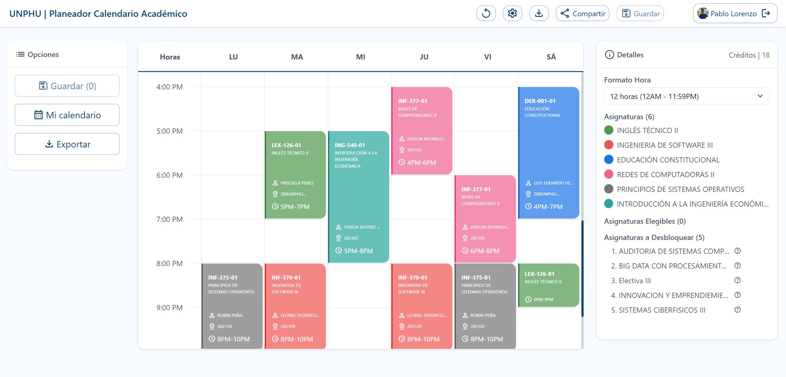

# Código y Demo
El código de este proyecto es privado. Puedes probar esta aplicación sin ser estudiante de la Universidad Nacional Pedro Henríquez Ureña con el siguiente [link](https://unphu-planeador-calendario-academico.onrender.com/pages?TEST=true)

# UNPHU | Planeador Académico
Esta aplicación web permite a los estudiantes de la [Universidad Pedro Henríquez Ureña (UNPHU)](https://unphu.edu.do) planificar de manera sencilla e informada su selección de materias para los próximos períodos académicos. Con más de 200 usuarios registrados y horarios planificados en los dos últimos períodos académicos del año 2024, esta herramienta ha demostrado su utilidad.

El desarrollo de esta aplicación fue un esfuerzo conjunto entre mi hermano [Jorge Lorenzo](https://github.com/JorgelRight34) y yo. Implementamos la solución utilizando Django y Django Rest Framework para el backend, React y Redux para el frontend, PostgreSQL como base de datos y Redis como sistema de caché.

Cabe destacar que la universidad no patrocinó este proyecto ni intervino en su desarrollo. La información de estudiantes y horarios se obtuvo a través de su API pública.

# Pantallas

# Contexto
En la [UNPHU](https://unphu.edu.do), los estudiantes tienen un período de selección de materias que dura aproximadamente una semana antes de iniciar el nuevo ciclo académico. A cada facultad se le asigna un día específico para que sus estudiantes inicien su selección de materias.

La selección no es simultánea para todos; la universidad organiza a los estudiantes en grupos según su índice académico. Aquellos con los índices más altos tienen prioridad para seleccionar sus materias y asegurar cupos antes que los estudiantes con índices más bajos.

Actualmente, los estudiantes solo pueden conocer los grupos disponibles para cada materia a través del [portal de estudiantes](https://estudiantes.unphusist.edu.do), 

Pero este se limita a mostrar los grupos existentes de una sola materia, por lo que
si el estudiante desea planificar su seleccion de materias completa deberia de forma manual asegurarse de que no exista conflicto entre ninguno de los grupos de las
materias que desea seleccionar, esto es un proceso arduoso e incomodo que motiva a muchos estudiantes no planear su seleccion de materias con antelacion y mejor esperar el momento en que le toque seleccionar.

Este portal presenta limitaciones:
- Solo permite visualizar los grupos de una materia a la vez, dificultando la planificación completa del horario.
- No indica qué materias pueden ser seleccionadas según los prerequisitos.
- No informa cuántos estudiantes tienen prioridad en la selección de cupos.
- No proporciona datos sobre los profesores ni sus estadísticas de rendimiento.
- No ofrece información sobre la dificultad percibida de las materias.

# Funcionalidades e implementación

## Autenticación con GoogleAuth
Los estudiantes pueden iniciar sesión con su cuenta institucional (@unphu.edu.do). Al registrarse, la aplicación obtiene información como carrera, índice, pensum y promoción mediante llamadas a la API de la UNPHU. Además, se cargan las calificaciones del usuario para generar estadísticas sobre materias y profesores.

La autenticación se gestiona con JSON Web Tokens (JWT), generando un refresh token y un access token, los cuales se almacenan en el local storage y se utilizan para acceder a rutas protegidas.

## Creación de horarios
La interfaz principal muestra:
- A la izquierda: Materias pendientes por cursar según el pensum del estudiante.
- A la derecha: Un espacio donde se construye el horario.

Para obtener las materias pendientes, la aplicación filtra los grupos disponibles para el próximo período académico a través de la API de la UNPHU. En el backend, se identifican las materias que el estudiante aún no ha cursado y se añade información adicional, como las materias que cada una desbloquea y los prerrequisitos cumplidos y faltantes. Esta información se almacena en caché por un día.

Los estudiantes pueden visualizar los grupos disponibles para cada materia y acceder a información detallada, como estadísticas de profesores y asignaturas.

Al hacer click en una materia se pueden ver los grupos disponibles.

Al hacer clic en un grupo, se pueden ver los detalles del mismo. El usuario puede elegir entre varias pestañas:

- **Información**: Muestra los detalles generales de la materia e información sobre el grupo seleccionado (como se muestra en la imagen anterior).
- **Datos (sección)**: Presenta las estadísticas del profesor impartiendo la materia.
- **Datos (asignatura)**: Ofrece las estadísticas de la asignatura en general.

## Estadísticas
La aplicación proporciona estadísticas para ayudar a los estudiantes a tomar decisiones informadas. Estas se dividen en:
- Histórico: Considera todos los registros disponibles.
- Reciente: Se basa en los registros del último año.

### Estadisticas Profesor-Asignatura

En la pestaña `Datos (sección)` se muestran estadísticas de los estudiantes que han cursado la materia con el profesor del grupo seleccionado:

- **Nota promedio**: Calificación promedio obtenida por los estudiantes.
- **Promedio de aprobaciones**: Porcentaje de estudiantes que aprobaron la materia.
- **Promedio de retiros**: Porcentaje de estudiantes que se retiraron de la materia.
- **Promedio de desaprobaciones**: Porcentaje de estudiantes que reprobaron la materia.
- **Muestra**: Número de estudiantes considerados para las estadísticas y cuántos de ellos están registrados en la aplicación.

### Estadisticas de la Asignatura.

Para obtener estas estadísticas, se consideran los registros y calificaciones de todos los estudiantes que hayan cursado la asignatura, independientemente del profesor que la impartió.

## Guardar calendarios
Los estudiantes pueden guardar su calendario para revisitarlo más tarde. Cuando inicien sesión nuevamente o regresen a la página de inicio mientras están autenticados, el horario guardado se cargará automáticamente en la interfaz.

Antes de guardar un horario, se realizan validaciones en el backend para asegurar que:
1. El estudiante tenga pendiente las materias seleccionadas.
2. No existan conflictos de horario entre los grupos.
3. La información no haya sido alterada en el cliente.
4. Se registre la demanda de cada grupo para calcular probabilidades de cupo.

Al cargar el horario en el cliente, el backend verifica la disponibilidad de cada grupo consultando la API de la UNPHU. Si algún grupo previamente guardado ha sido modificado en la base de datos de la universidad, el backend actualiza el calendario del estudiante con la nueva información. En caso de que el horario de algún grupo haya cambiado, se elimina todo el calendario guardado. Esto asegura que el estudiante siempre tenga la información más actualizada.

## Exportación y Compartición de Horarios
Los horarios pueden exportarse en formato CSV, PDF y JPG. Además, los estudiantes pueden compartir su horario mediante una URL, permitiendo a otros visualizar su planificación.

# Alcance

- Disponible para todos los estudiantes de UNPHU, sin importar su carrera.

